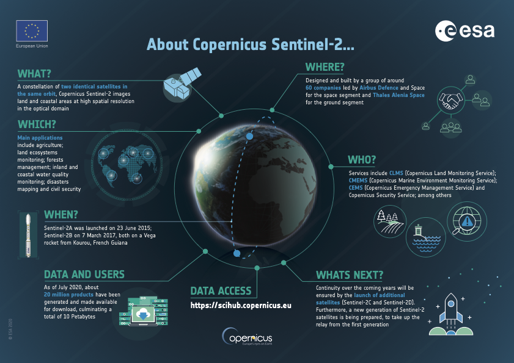
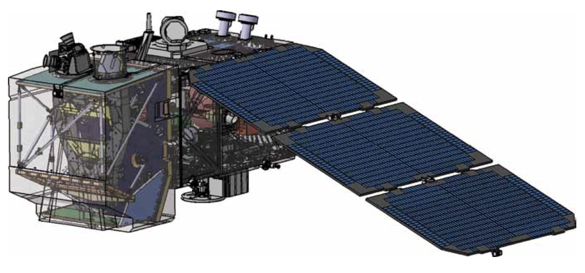
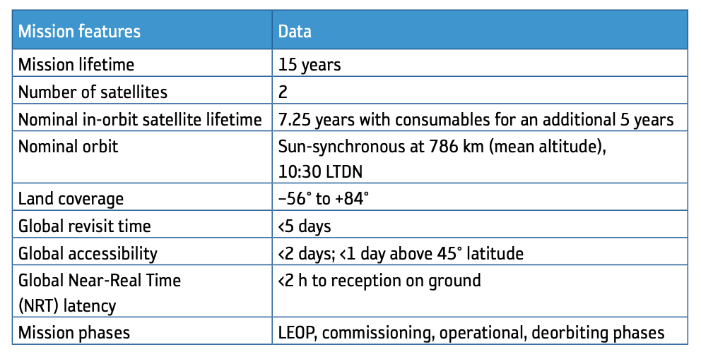
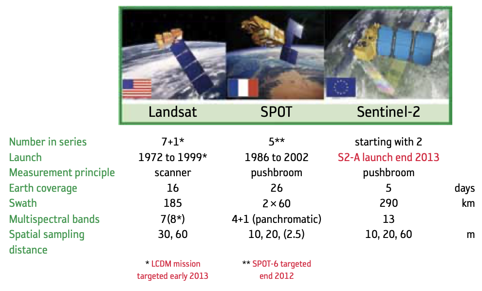
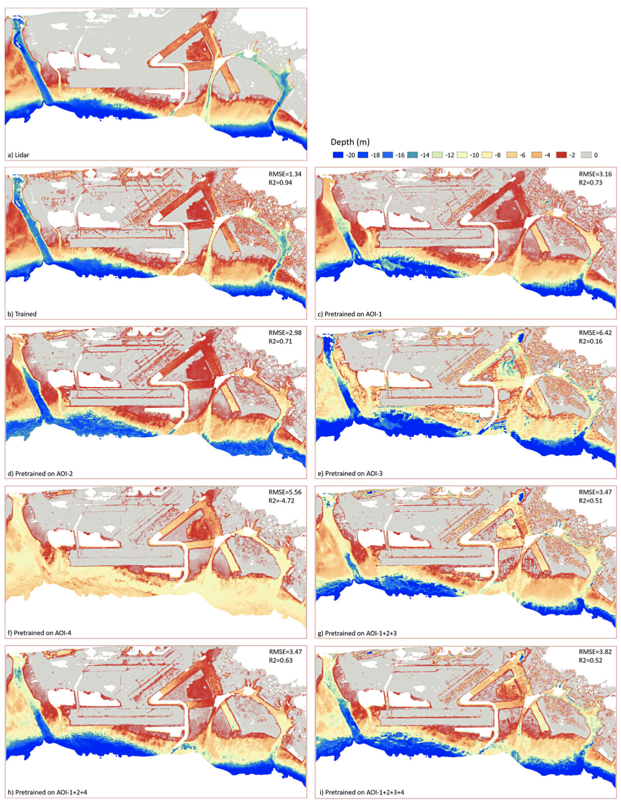
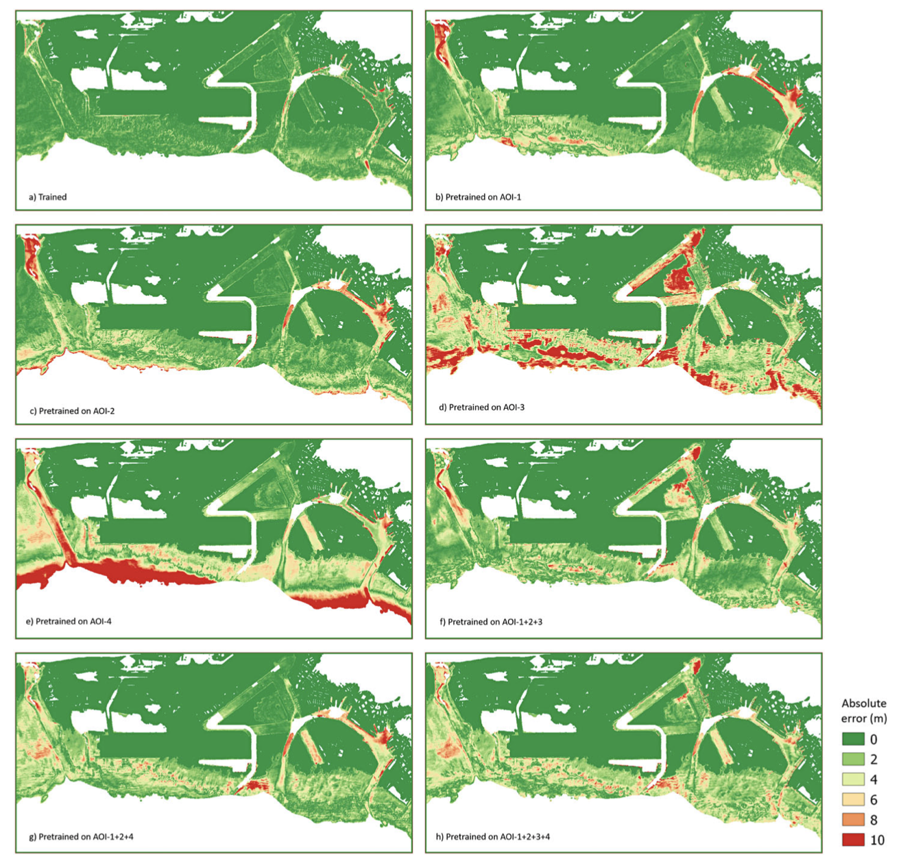

class: center middle
```{r setup, include=FALSE}
options(htmltools.dir.version = FALSE)
```

```{r xaringan-themer, include=FALSE, warning=FALSE}
library(xaringanthemer)
style_duo_accent(
  primary_color = "#327CA7",
  secondary_color = "#FFC94A",
  inverse_header_color = "#1C5174",
  inverse_text_color = "#1C5174",
  header_font_google = google_font("Ubuntu"),
  text_font_google   = google_font("Montserrat", "400", "400i"),
  code_font_google   = google_font("Fira Mono"),
  title_slide_background_image = "img/space.jpg"
)
```

```{r echo=FALSE}
library(RefManageR)
BibOptions(check.entries = FALSE,
           bib.style = "authoryear",
           cite.style = "authoryear",
           style = "markdown",
           hyperlink = TRUE,
           dashed = FALSE)
           #no.print.fields=c("doi", "url", "urldate", "issn"))
myBib <- ReadBib("rs-sensor.bib", check = FALSE)
```

```{r xaringan-all, echo=FALSE}
library(countdown)
library(xaringan)
library(xaringanExtra)
library(knitr)
hook_source <- knitr::knit_hooks$get('source')
knitr::knit_hooks$set(source = function(x, options) {
  x <- stringr::str_replace(x, "^[[:blank:]]?([^*].+?)[[:blank:]]*#<<[[:blank:]]*$", "*\\1")
  hook_source(x, options)
})

xaringanExtra::use_tile_view()
xaringanExtra::use_broadcast()
xaringanExtra::use_panelset()
xaringanExtra::use_tachyons()
xaringanExtra::use_search(show_icon = TRUE, auto_search = FALSE)
xaringanExtra::use_progress_bar(color = "#FFC94A", location = "bottom")
```

```{r load_packages, message=FALSE, warning=FALSE, include=FALSE}
library(fontawesome)
```

<center></center>
.bg-.b--yellow.ba.bw2.br2.shadow-2.ph3.mt3[
## "Remote sensing is the acquiring of information from a distance."
.tr[
**— NASA**
]]

---
class: inverse center middle

# Summary

Earth Observation mission from the Copernicus Programme

---

## Sentinel-2

.panelset[
.panel[.panel-name[**Sentinel-2**]

```{r echo=FALSE, out.width='50%', fig.align='center'}

```
Source: [ESA](https://sentinels.copernicus.eu/web/sentinel/missions/sentinel-2) `r Citep(myBib, "esaSentinel2MissionsSentinel")`

]

.panel[.panel-name[**Overview**]

.pull-left[

SENTINEL-2 is a high-resolution, multi-spectral imaging mission consisting of two twin satellites in the same orbit with a high revisit frequency of 5 days at the Equator. The satellites carry an optical instrument payload that samples 13 spectral bands at different spatial resolutions, providing an orbital swath width of 290 km. The SENTINEL-2 mission continues the legacy of SPOT and LANDSAT and supports various services and applications offered by Copernicus, including land management, agriculture, forestry, disaster control, humanitarian relief operations, risk mapping, and security concerns.

]

.pull-right[

```{r echo=FALSE, out.width='100%', fig.align='center'}

```
Source: [Astrium GmBH, Germany](https://artes.esa.int/contractors/eads-astrium-gmbh)`r Citep(myBib, "eadsEADSAstriumGmbH")`

]
]

.panel[.panel-name[**Key-Features**]

.pull-left[

Sentinel is the [Earth Observation](https://joint-research-centre.ec.europa.eu/scientific-activities-z/earth-observation_en) mission from the [Copernicus Programme](https://www.copernicus.eu/en/about-copernicus) `r Citep(myBib, "Sentinel2MissionsSentinel")`

The SENTINEL-2 satellite aims to provide high-resolution, multispectral images with a high revisit frequency on a global scale. Its objectives are outlined in the Mission Requirements Document and include providing continuity for multi-spectral imagery from SPOT and LANDSAT satellites, generating data for operational products like land-cover maps, and contributing to Copernicus themes like climate change and land monitoring. With its 13 spectral bands, 290 km swath width, and high revisit frequency, SENTINEL-2's MSI instrument is well-suited for a range of land studies and programmes, including land cover/change classification, atmospheric correction, and cloud/snow masks.

]

.pull-right[

```{r echo=FALSE, out.width='100%', fig.align='center'}

```
Source: [Astrium GmBH, Germany](https://artes.esa.int/contractors/eads-astrium-gmbh)`r Citep(myBib, "eadsEADSAstriumGmbH")`

]
]

.panel[.panel-name[**Comparison**]

```{r echo=FALSE, out.width='55%', fig.align='center'}

```
Comparison of the capabilities of Landsat, SPOT and Sentinel-2.<br>
Source: [Astrium GmBH, Germany](https://artes.esa.int/contractors/eads-astrium-gmbh)`r Citep(myBib, "eadsEADSAstriumGmbH")`

]

.panel[.panel-name[**Bands**]

<style>
div.remark-slide-content {
  padding: 2em; /*default is 1em 4em*/
  font-size: .6em;
}
</style>

```{r doasyouretold,echo=F,include=F}

library(tidyverse)
library(DT)

df <- structure(list(
  Bands = c("Coastal aerosol", "Blue", "Green", "Red", "Vegetation Red Edge", "Vegetation Red Edge", "Vegetation Red Edge", "NIR", "Narrow NIR", "Water Vapour", "SWIR - Cirrus", "SWIR", "SWIR"),
  Sensor = c("MSI","MSI","MSI","MSI","MSI","MSI","MSI","MSI","MSI","MSI","MSI","MSI","MSI"), 
  Number = c(1,2,3,4,5,6,7,8,9,10,11,12,13), 
  "Sentinel-2A" = c(443.9,496.6,560.0,664.5,703.9,740.2,782.5,835.1,864.8,945.0,1373.5,1613.7,2202.4),
  "Number-Central Wavelength (nm)" = c(20,65,35,30,15,15,20,115,20,20,30,90,180), 
  "Sentinel-2B Bandwidth (nm)" = c(442.3,492.1,559,665,703.8,739.1,779.7,833,864,943.2,1376.9,1610.4,2185.7),
  "Central wavelength (nm)-2" = c(20,65,35,30,15,15,20,115,20,20,30,90,180),
  "Resolution (meters)-Bandwith (nm)-2" = c(60,10,10,10,20,20,20,10,20,60,60,20,20)),
  sfc_columns = c("x", "y"), class = "data.frame", row.names = c(NA, -13L))

```


```{r gimmeNow,echo=F}

datatable(df,
         # style = "font-size: 75%; width: 75%")  %>% <- this doesn't go here...
         ) %>% 
  formatStyle(names(df), background = 'white', angle = -90,
              backgroundSize = '98% 88%', backgroundRepeat = 'no-repeat',
              backgroundPosition = 'center')

```

Source: [EOS Data Analytics](https://eos.com/find-satellite/sentinel-2/)`r Citep(myBib,"eosSentinel2SatelliteImagery2021")`
]
]

---

class: inverse center middle

# Application

---

## Marine/Coastal Monitoring

The study by Yustisi Lumban-Gaol, Ken Arroyo Ohori, and Ravi Peters, published in Marine Geodesy in 2022, extracted water depth information in coastal areas using multi-temporal Sentinel-2 satellite images and convolutional neural networks (CNNs). The study is motivated by the importance of water depth information for various applications, such as navigation safety, coastal zone management, and ecosystem conservation. `r Citep(myBib,"lumban-gaolExtractingCoastalWater2022")` used a CNN model architecture that consists of two convolutional layers followed by two fully connected layers. The input to the CNN model is a multi-temporal Sentinel-2 image, and the output is a water depth map. The authors also experimented with different input combinations of Sentinel-2 bands, temporal differences, and spatial filters to optimize the performance of the CNN model. The accuracy of the depth estimates achieved in this study is promising for applications such as navigation safety and coastal zone management. The authors suggest that further research can explore the application of the CNN models to other coastal areas with different water properties and bathymetric characteristics.

.pull-left[

```{r echo=FALSE, out.width='55%', fig.align='center'}

```
Source: `r Citep(myBib,"lumban-gaolExtractingCoastalWater2022")`

]

.pull-right[

```{r echo=FALSE, out.width='75%', fig.align='center'}

```
Source: `r Citep(myBib,"lumban-gaolExtractingCoastalWater2022")`

]

---
class: inverse center middle

# Reflection

---

## Reflection

it is clear that Sentinel-2 is a powerful tool for various applications such as land cover mapping, vegetation monitoring, and water quality assessment. Its multi-spectral imaging capability and high spatial resolution provide valuable data for research and analysis. The study you mentioned on extracting coastal water depths using Sentinel-2 images is a great example of the satellite's potential for oceanographic applications.

The study of Sentinel-2 application demonstrates how the use of convolutional neural networks (CNNs) can extract information on coastal water depths from Sentinel-2 images with high accuracy. This approach can provide a cost-effective and efficient way of collecting data on coastal bathymetry, which is essential for a variety of marine applications such as coastal zone management, fisheries management, and environmental monitoring.

The capabilities of Sentinel-2 and the advancements in image processing techniques, such as CNNs, have allowed for new insights and opportunities in remote sensing applications. The increasing availability of high-quality satellite data has the potential to revolutionize our understanding of the natural world and inform policy and decision-making.

---

# Reference

```{r results='asis', echo=FALSE}
PrintBibliography(myBib)
```

---
class: inverse center middle

# Thanks!

Slides created via the R packages:

[**xaringan**](https://github.com/yihui/xaringan) by<br>[**Yihui Xi**](https://yihui.org)<br>
[**xaringanthemer**](https://github.com/gadenbuie/xaringanthemer) and
[**xaringanExtra**](https://github.com/gadenbuie/xaringanExtra) by<br>[**Garrick Aden Buie**](https://www.garrickadenbuie.com)

This slide is inspired by and adapted from<br>[**Dr Andrew Maclachlan's lecture**](https://andrewmaclachlan.github.io/CASA0023-lecture-2/#1)

---